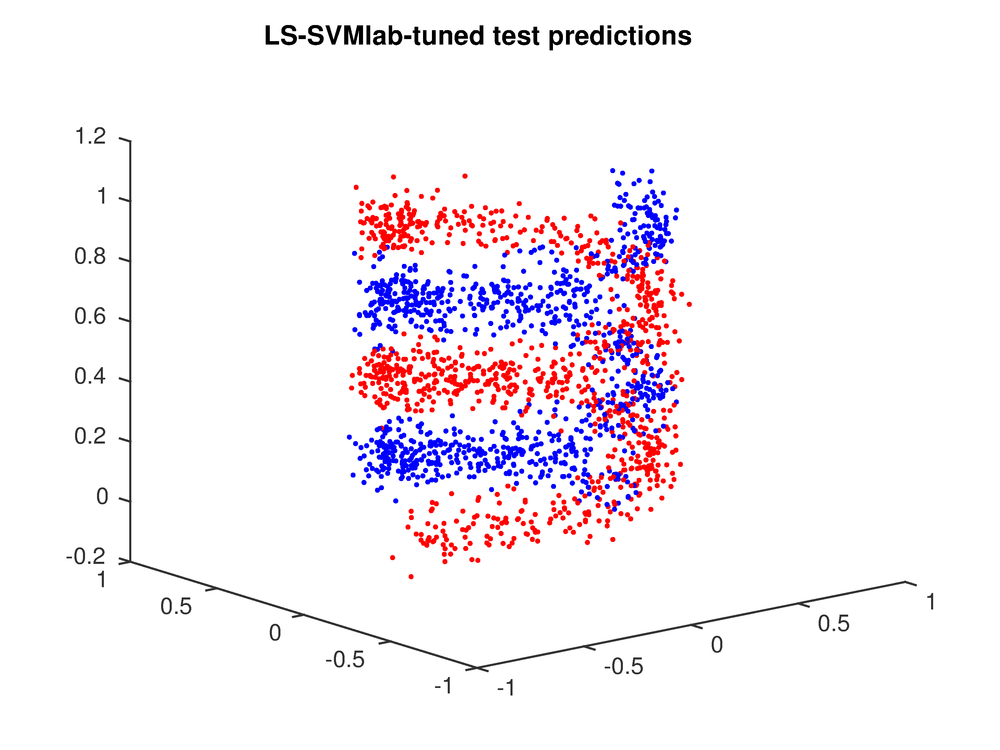

Least-squares SVM classification
===================================

.. include:: /global.rst

You can find a MATLAB script for this example in `<optunity>/wrappers/matlab/example_lssvmlab/demo_classification.m` in your Optunity release.

In this example, we will perform nonlinear classification using LS-SVM with RBF kernel using the LS-SVMlab toolbox. 
In this case, we have to tune two hyperparameters: `gam` (regularization) and `sig2` (kernel bandwidth).
We will 10-fold cross-validation to test a pair of hyperparameters.

In this example, we will use |minimize| to minimize misclassification rate.

Start off by defining the objective function, we will generate a double helix for classification::

    r = 0.5;
    h = 1;
    helix = @(x, theta, n) [x + r*cos(theta + linspace(0, 4*pi, n)); ...
            r*sin(theta + linspace(0, 4*pi, n)); linspace(0, h, n)]';

    noise = 0.1;
    ntr = 200;
    pos = helix(0, 0, ntr);
    neg = helix(0, pi, ntr);
    X = [pos; neg] + noise*randn(2*ntr, 3);
    Y = [ones(ntr, 1); -1*ones(ntr, 1)];

Now that we have training data, we can use LS-SVMlab and Optunity for tuning. In this example we use LS-SVMlab's (verbose) functional API.

Tuning with LS-SVMlab's built in procedure (in this case a combination of coupled simulated annealing and Nelder-Mead simplex)::

    [lssvm_gam, lssvm_sig2] = tunelssvm({X,Y,'c',[],[],'RBF_kernel'}, 'simplex',...
            'leaveoneoutlssvm', {'misclass'});
    [alpha_lssvm,b_lssvm] = trainlssvm({X,Y,type,lssvm_gam,lssvm_sig2,'RBF_kernel'});

To do the same with Optunity, we must first define an objective function, lets say `demo_classification_misclass.m`::

    function [ misclass ] = demo_classification_misclass( x_train, y_train, x_test, y_test, pars )

    % train model
    [alpha,b] = trainlssvm({x_train,y_train,'classification',pars.gam,pars.sig2,'RBF_kernel'});

    % predict test data
    Yt = simlssvm({x_train,y_train,'classification',pars.gam,pars.sig2,'RBF_kernel','preprocess'},{alpha,b},x_test);

    % compute misclassification rate
    misclass = sum(Yt ~= y_test)/numel(Yt);
    end

The objective function seems quite involved but it's essentially training a model, predicting test data and evaluating. 
The code to perform the actual tuning (we use 10-fold cross-validation)::

    obj_fun = optunity.cross_validate(@demo_classification_misclass, X, 'y', Y, 'num_folds', 10);
    opt_pars = optunity.minimize(obj_fun, 100, 'gam', [1, 100], 'sig2', [0.01, 2]);
    [alpha_optunity,b_optunity] = trainlssvm({X,Y,type,opt_pars.gam,opt_pars.sig2,'RBF_kernel'});

Now we have two LS-SVM models, one tuned with LS-SVM's own algorithms and one using Optunity. For this particular problem,
their performance is close to equivalent. The figures below shows test set predictions for both models.

    Test set predictions of LS-SVM after tuning with LS-SVMlab.

.. figure:: classification_optunity.png
    :width: 400

    Test set predictions of LS-SVM after tuning with Optunity.
