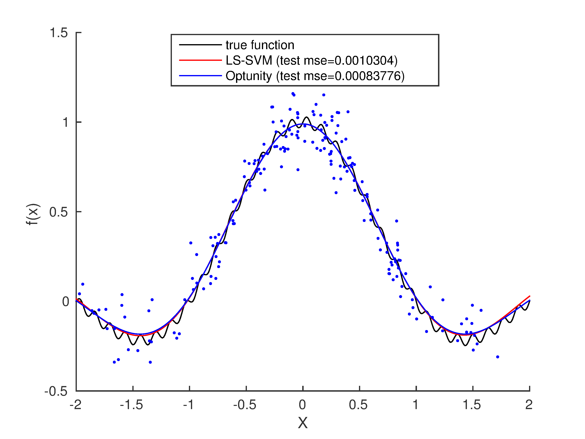

Least-squares SVM regression
===================================

.. include:: /global.rst

You can find a MATLAB script for this example in `<optunity>/wrappers/matlab/example_lssvmlab/demo_regression.m` in your Optunity release.

In this example, we will perform nonlinear regression using LS-SVM with RBF kernel using the LS-SVMlab toolbox. 
In this case, we have to tune two hyperparameters: `gam` (regularization) and `sig2` (kernel bandwidth).
We will 10-fold cross-validation to test a pair of hyperparameters.

In this example, we will use |minimize| to minimize mean squared error (MSE).

Start off by defining the objective function::

    fun = @(X) sinc(X) + 0.03 * sin(15*pi * X);

This is a simple sinc function with a high frequency sine wave imposed. Now lets generate some noisy data::

    X = randn(200, 1);
    Y = fun(X)+0.1*randn(length(X),1);

Now that we have the function we want to estimate, and data to use for it, we can use LS-SVMlab and Optunity for tuning.
In this example we use LS-SVMlab's (verbose) functional API.

Tuning with LS-SVMlab's built in procedure (in this case a combination of coupled simulated annealing and Nelder-Mead simplex)::

    [lssvm_gam, lssvm_sig2] = tunelssvm({X,Y,'f',[],[],'RBF_kernel'}, ...
            'simplex', 'leaveoneoutlssvm', {'mse'});
    type = 'function estimation';
    [alpha_lssvm,b_lssvm] = trainlssvm({X,Y,type,lssvm_gam,lssvm_sig2,'RBF_kernel'});

To do the same with Optunity, we must first define an objective function, lets say `demo_regression_mse.m`::

    function [ mse ] = demo_regression_mse( x_train, y_train, x_test, y_test, pars )

    % train model
    type = 'function estimation';
    [alpha,b] = trainlssvm({x_train,y_train,type,pars.gam,pars.sig2,'RBF_kernel'});

    % predict test data
    Yt = simlssvm({x_train,y_train,type,pars.gam,pars.sig2, ...
            'RBF_kernel','preprocess'},{alpha,b},x_test);

    % compute mse
    mse = sum((y_test - Yt).^2) / numel(y_test);
    end

The objective function seems quite involved but it's essentially training a model, predicting test data and evaluating. 
The code to perform the actual tuning (we use 10-fold cross-validation)::

    obj_fun = optunity.cross_validate(@demo_regression_mse, X, 'y', Y, 'num_folds', 10);
    opt_pars = optunity.minimize(obj_fun, 100, 'gam', [1, 30], 'sig2', [0.01, 1]);
    [alpha_optunity,b_optunity] = trainlssvm({X, Y, type, ...
            opt_pars.gam, opt_pars.sig2, 'RBF_kernel'});

Now we have two LS-SVM models, one tuned with LS-SVM's own algorithms and one using Optunity. For this particular problem,
their performance is close to equivalent. The figure below shows test set predictions.

    Test set predictions and the true function.

