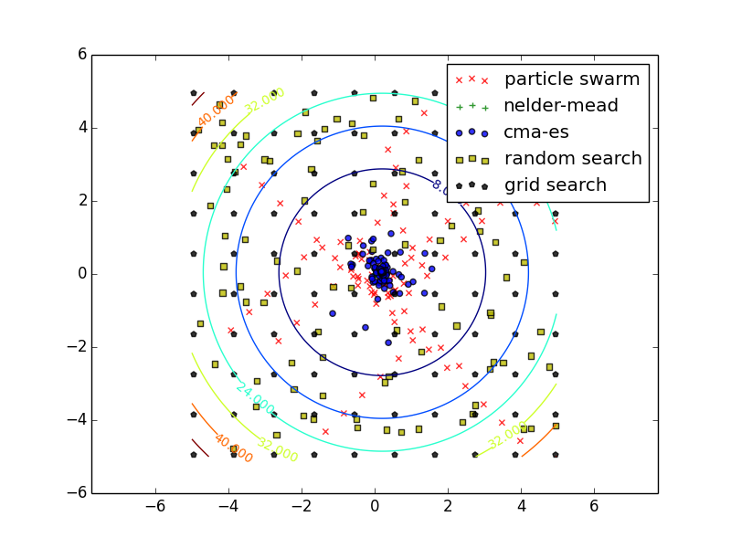
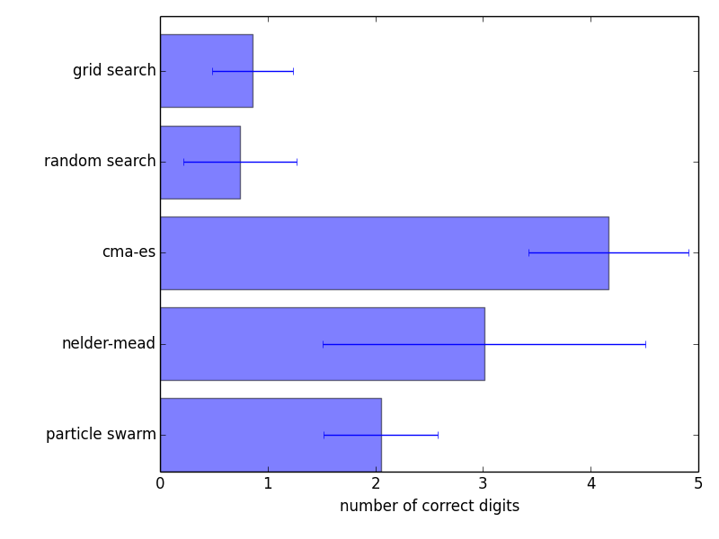

Optimizing a simple 2D parabola
================================

.. include:: /global.rst

In this example, we will use Optunity to optimize a very simple function, namely a two-dimensional parabola.

More specifically, the objective function is :math:`f(x, y) = -x^2 - y^2`.

The full code in Python::

    import optunity

    def f(x, y):
        return -x**2 - y**2

    optimal_pars, details, _ = optunity.maximize(f, num_evals=100, x=[-5, 5], y=[-5, 5])

For such simple functions we would use different solvers in practice, but the main idea remains.

To get a basic understanding of the way various solvers in Optunity work, we can optimize this function with all solvers and plot the resulting call logs.
The source code for this example is available in `bin/examples/python/parabola.py`. Below are plots of the traces and precision of various solvers in optimizing a 2D parabola.
These results are averaged over 200 runs, in each run the solvers got a budget of 100 function evaluations with the box :math:`x=(-5, 5)`, :math:`y=-(5, 5)`.

Note that both |nelder-mead| and |cmaes| started from an initial solution close to the optimal one. 
The results on this toy problem do not generalize directly to a real tuning problem.

    Solver traces showing the evolution of their search for a single run on the 2D parabola.

    Log10 of the precision of each solver's optimum, averaged across all runs.

