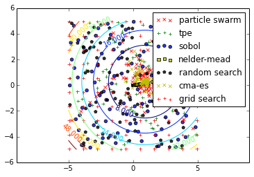
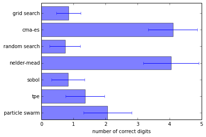

Basic: minimizing a simple function
===================================

In this example we will use various Optunity solvers to minimize the
following simple 2d parabola:

.. math:: f(x, y) = (x - x_{off})^2 + (y - y_{off})^2,

where :math:`x_{off}` and :math:`y_{off}` are randomly determined
offsets.

.. code:: python

    def create_objective_function():
        xoff = random.random()
        yoff = random.random()
        def f(x, y):
            return (x - xoff)**2 + (y - yoff)**2
        return f
We start with the necessary imports.

.. code:: python

     # comment this line when running the notebook yourself
    %matplotlib inline
    
    import math
    import optunity
    import random
    import numpy as np
    import matplotlib.pyplot as plt
    import matplotlib.ticker as ticker
First we check which solvers are available. This is available via
``optunity.available_solvers``.

.. code:: python

    solvers = optunity.available_solvers()
    print('Available solvers: ' + ', '.join(solvers))

.. parsed-literal::

    Available solvers: particle swarm, tpe, sobol, nelder-mead, random search, cma-es, grid search

To run an experiment, we start by generating an objective function.

.. code:: python

    f = create_objective_function()
Now we use every available solver to optimize the objective function
within the box :math:`x\in\ ]-5, 5[` and :math:`y\in\ ]-5, 5[` and save
the results.

.. code:: python

    logs = {}
    for solver in solvers:
        pars, details, _ = optunity.minimize(f, num_evals=100, x=[-5, 5], y=[-5, 5], solver_name=solver)
        logs[solver] = np.array([details.call_log['args']['x'],
                                 details.call_log['args']['y']])
Finally, lets look at the results, that is the trace of each solver
along with contours of the objective function.

.. code:: python

    # make sure different traces are somewhat visually separable
    colors =  ['r', 'g', 'b', 'y', 'k', 'y', 'r', 'g']
    markers = ['x', '+', 'o', 's', 'p', 'x', '+', 'o']
    
    # compute contours of the objective function
    delta = 0.025
    x = np.arange(-5.0, 5.0, delta)
    y = np.arange(-5.0, 5.0, delta)
    X, Y = np.meshgrid(x, y)
    Z = f(X, Y)
    
    CS = plt.contour(X, Y, Z)
    plt.clabel(CS, inline=1, fontsize=10, alpha=0.5)
    for i, solver in enumerate(solvers):
        plt.scatter(logs[solver][0,:], logs[solver][1,:], c=colors[i], marker=markers[i], alpha=0.80)
    
    plt.xlim([-5, 5])
    plt.ylim([-5, 5])
    plt.axis('equal')
    plt.legend(solvers)
    plt.show()

Now lets see the performance of the solvers across in 100 repeated
experiments. We will do 100 experiments for each solver and then report
the resulting statistics. This may take a while to run.

.. code:: python

    optima = dict([(s, []) for s in solvers])
    for i in range(100):
        f = create_objective_function()
    
        for solver in solvers:
            pars, details, _ = optunity.minimize(f, num_evals=100, x=[-5, 5], y=[-5, 5],
                                                 solver_name=solver)
            # the above line can be parallelized by adding `pmap=optunity.pmap`
            # however this is incompatible with IPython
    
            optima[solver].append(details.optimum)
            logs[solver] = np.array([details.call_log['args']['x'],
                                     details.call_log['args']['y']])
    
    from collections import OrderedDict
    log_optima = OrderedDict()
    means = OrderedDict()
    std = OrderedDict()
    for k, v in optima.items():
        log_optima[k] = [-math.log10(val) for val in v]
        means[k] = sum(log_optima[k]) / len(v)
        std[k] = np.std(log_optima[k])
    
    plt.barh(np.arange(len(means)), means.values(), height=0.8, xerr=std.values(), alpha=0.5)
    plt.xlabel('number of correct digits')
    plt.yticks(np.arange(len(means))+0.4, list(means.keys()))
    plt.tight_layout()
    plt.show()

