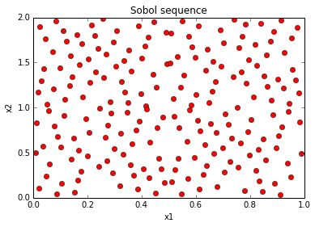

Basic: Sobol sequences
======================

In this example we will show the difference between a 2-d Sobol sequence
and sampling uniformly at random in 2 dimensions. We will use the
``sobol`` and ``random-search`` solvers. The Sobol sequence has lower
discrepancy, i.e., the generated samples are spread out better in the
sampling space.

This example requires matplotlib to generate figures.

.. code:: python

    #uncomment the following line when you run this notebook interactively
    %matplotlib inline
    import matplotlib.pyplot as plt
    import optunity
    import random
Basic configuration and a dummy objective function. We don't care about
the returned function value, just the spread of samples.

.. code:: python

    def f(x1, x2):
        return 0.0
We run the random search solver and Sobol sequence solver.

.. code:: python

    _, info_random, _ = optunity.minimize(f, num_evals=200, x1=[0, 1], x2=[0, 2], solver_name='random search')
    plt.plot(info_random.call_log['args']['x1'], info_random.call_log['args']['x2'], 'bo')
    plt.xlabel('x1')
    plt.ylabel('x2')
    plt.title('Random search')
    plt.show()

.. image:: basic-sobol_files/output_6_0.png

.. code:: python

    _, info_sobol, _ = optunity.minimize(f, num_evals=200, x1=[0, 1], x2=[0, 2], solver_name='sobol')
    plt.plot(info_sobol.call_log['args']['x1'], info_sobol.call_log['args']['x2'], 'ro')
    plt.xlabel('x1')
    plt.ylabel('x2')
    plt.title('Sobol sequence')
    plt.show()

