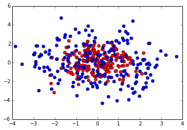
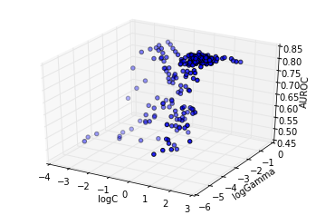
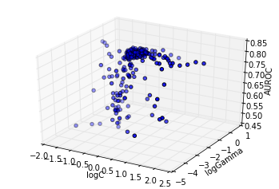
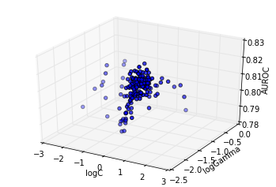

Optimization response surface
=============================

In this example we will use Optunity to optimize hyperparameters for a
support vector machine classifier (SVC) in scikit-learn. We will
construct a simple toy data set to illustrate that the response surface
can be highly irregular for even simple learning tasks (i.e., the
response surface is non-smooth, non-convex and has many local minima).

.. code:: python

    import optunity
    import optunity.metrics
    
    # comment this line if you are running the notebook
    import sklearn.svm
    import numpy as np
    import math
    import pandas
    
    %matplotlib inline
    from matplotlib import pylab as plt
    from mpl_toolkits.mplot3d import Axes3D
Create a 2-D toy data set.

.. code:: python

    npos = 200
    nneg = 200
    
    delta = 2 * math.pi / npos
    radius = 2
    circle = np.array(([(radius * math.sin(i * delta), 
                         radius * math.cos(i * delta)) 
                        for i in range(npos)]))
    
    neg = np.random.randn(nneg, 2)
    pos = np.random.randn(npos, 2) + circle
    
    data = np.vstack((neg, pos))
    labels = np.array([False] * nneg + [True] * npos)
Lets have a look at our 2D data set.

.. code:: python

    plt.plot(neg[:,0], neg[:,1], 'ro')
    plt.plot(pos[:,0], pos[:,1], 'bo')

.. parsed-literal::

    [<matplotlib.lines.Line2D at 0x7f1f2a6a2b90>]

In order to use Optunity to optimize hyperparameters, we start by
defining the objective function. We will use 5-fold cross-validated area
under the ROC curve. We will regenerate folds for every iteration, which
helps to minimize systematic bias originating from the fold
partitioning.

We start by defining the objective function ``svm_rbf_tuned_auroc()``,
which accepts :math:`C` and :math:`\gamma` as arguments.

.. code:: python

    @optunity.cross_validated(x=data, y=labels, num_folds=5, regenerate_folds=True)
    def svm_rbf_tuned_auroc(x_train, y_train, x_test, y_test, logC, logGamma):
        model = sklearn.svm.SVC(C=10 ** logC, gamma=10 ** logGamma).fit(x_train, y_train)
        decision_values = model.decision_function(x_test)
        auc = optunity.metrics.roc_auc(y_test, decision_values)
        return auc
Now we can use Optunity to find the hyperparameters that maximize AUROC.

.. code:: python

    optimal_rbf_pars, info, _ = optunity.maximize(svm_rbf_tuned_auroc, num_evals=300, logC=[-4, 2], logGamma=[-5, 0])
    # when running this outside of IPython we can parallelize via optunity.pmap
    # optimal_rbf_pars, _, _ = optunity.maximize(svm_rbf_tuned_auroc, 150, C=[0, 10], gamma=[0, 0.1], pmap=optunity.pmap)
    
    print("Optimal parameters: " + str(optimal_rbf_pars))
    print("AUROC of tuned SVM with RBF kernel: %1.3f" % info.optimum)

.. parsed-literal::

    Optimal parameters: {'logGamma': -1.7262599731822696, 'logC': 0.5460942232689681}
    AUROC of tuned SVM with RBF kernel: 0.825

We can turn the call log into a pandas dataframe to efficiently inspect
the solver trace.

.. code:: python

    df = optunity.call_log2dataframe(info.call_log)
The past function evaluations indicate that the response surface is
filled with local minima, caused by finite sample effects. To see this,
we can make surface plots.

.. code:: python

    cutoff = 0.5
    fig = plt.figure()
    ax = fig.add_subplot(111, projection='3d')
    ax.scatter(xs=df[df.value > cutoff]['logC'], 
               ys=df[df.value > cutoff]['logGamma'], 
               zs=df[df.value > cutoff]['value'])
    ax.set_xlabel('logC')
    ax.set_ylabel('logGamma')
    ax.set_zlabel('AUROC')

.. parsed-literal::

    <matplotlib.text.Text at 0x7f1f26cbed50>

The above plot shows the particles converge directly towards the
optimum. At this granularity, the response surface appears smooth.

However, a more detailed analysis reveals this is not the case, as shown
subsequently: - showing the sub trace with score up to 90% of the
optimum - showing the sub trace with score up to 95% of the optimum -
showing the sub trace with score up to 99% of the optimum

.. code:: python

    cutoff = 0.9 * info.optimum
    fig = plt.figure()
    ax = fig.add_subplot(111, projection='3d')
    ax.scatter(xs=df[df.value > cutoff]['logC'], 
               ys=df[df.value > cutoff]['logGamma'], 
               zs=df[df.value > cutoff]['value'])
    ax.set_xlabel('logC')
    ax.set_ylabel('logGamma')
    ax.set_zlabel('AUROC')

.. parsed-literal::

    <matplotlib.text.Text at 0x7f1f2a5c3190>

.. code:: python

    cutoff = 0.95 * info.optimum
    fig = plt.figure()
    ax = fig.add_subplot(111, projection='3d')
    ax.scatter(xs=df[df.value > cutoff]['logC'], 
               ys=df[df.value > cutoff]['logGamma'], 
               zs=df[df.value > cutoff]['value'])
    ax.set_xlabel('logC')
    ax.set_ylabel('logGamma')
    ax.set_zlabel('AUROC')

.. parsed-literal::

    <matplotlib.text.Text at 0x7f1f26ae5410>

Lets further examine the area close to the optimum, that is the 95%
region. We will examine a 50x50 grid in this region.

.. code:: python

    minlogc = min(df[df.value > cutoff]['logC'])
    maxlogc = max(df[df.value > cutoff]['logC'])
    minloggamma = min(df[df.value > cutoff]['logGamma'])
    maxloggamma = max(df[df.value > cutoff]['logGamma'])
    
    _, info_new, _ = optunity.maximize(svm_rbf_tuned_auroc, num_evals=2500, 
                                       logC=[minlogc, maxlogc], 
                                       logGamma=[minloggamma, maxloggamma], 
                                       solver_name='grid search')
Make a new data frame of the call log for easy manipulation.

.. code:: python

    df_new = optunity.call_log2dataframe(info_new.call_log)
Determine the region in which we will do a standard grid search to
obtain contours.

.. code:: python

    reshape = lambda x: np.reshape(x, (50, 50))
    logcs = reshape(df_new['logC'])
    loggammas = reshape(df_new['logGamma'])
    values = reshape(df_new['value'])
Now, lets look at a contour plot to see whether or not the response
surface is smooth.

.. code:: python

    levels = np.arange(0.97, 1.0, 0.005) * info_new.optimum
    CS = plt.contour(logcs, loggammas, values, levels=levels)
    plt.clabel(CS, inline=1, fontsize=10)
    plt.title('Contours of SVM tuning response surface')
    plt.xlabel('log C')
    plt.ylabel('log gamma')

.. parsed-literal::

    /usr/lib/pymodules/python2.7/matplotlib/contour.py:483: DeprecationWarning: using a non-integer number instead of an integer will result in an error in the future
      nlc.append(np.r_[lc[:I[0] + 1], xy1])
    /usr/lib/pymodules/python2.7/matplotlib/contour.py:485: DeprecationWarning: using a non-integer number instead of an integer will result in an error in the future
      nlc.append(np.r_[xy2, lc[I[1]:]])
    /usr/lib/pymodules/python2.7/matplotlib/contour.py:483: DeprecationWarning: using a non-integer number instead of an integer will result in an error in the future
      nlc.append(np.r_[lc[:I[0] + 1], xy1])
    /usr/lib/pymodules/python2.7/matplotlib/contour.py:485: DeprecationWarning: using a non-integer number instead of an integer will result in an error in the future
      nlc.append(np.r_[xy2, lc[I[1]:]])
    /usr/lib/pymodules/python2.7/matplotlib/contour.py:483: DeprecationWarning: using a non-integer number instead of an integer will result in an error in the future
      nlc.append(np.r_[lc[:I[0] + 1], xy1])
    /usr/lib/pymodules/python2.7/matplotlib/contour.py:485: DeprecationWarning: using a non-integer number instead of an integer will result in an error in the future
      nlc.append(np.r_[xy2, lc[I[1]:]])
    /usr/lib/pymodules/python2.7/matplotlib/contour.py:483: DeprecationWarning: using a non-integer number instead of an integer will result in an error in the future
      nlc.append(np.r_[lc[:I[0] + 1], xy1])
    /usr/lib/pymodules/python2.7/matplotlib/contour.py:485: DeprecationWarning: using a non-integer number instead of an integer will result in an error in the future
      nlc.append(np.r_[xy2, lc[I[1]:]])
    /usr/lib/pymodules/python2.7/matplotlib/contour.py:483: DeprecationWarning: using a non-integer number instead of an integer will result in an error in the future
      nlc.append(np.r_[lc[:I[0] + 1], xy1])
    /usr/lib/pymodules/python2.7/matplotlib/contour.py:485: DeprecationWarning: using a non-integer number instead of an integer will result in an error in the future
      nlc.append(np.r_[xy2, lc[I[1]:]])
    /usr/lib/pymodules/python2.7/matplotlib/contour.py:483: DeprecationWarning: using a non-integer number instead of an integer will result in an error in the future
      nlc.append(np.r_[lc[:I[0] + 1], xy1])
    /usr/lib/pymodules/python2.7/matplotlib/contour.py:485: DeprecationWarning: using a non-integer number instead of an integer will result in an error in the future
      nlc.append(np.r_[xy2, lc[I[1]:]])
    /usr/lib/pymodules/python2.7/matplotlib/contour.py:483: DeprecationWarning: using a non-integer number instead of an integer will result in an error in the future
      nlc.append(np.r_[lc[:I[0] + 1], xy1])
    /usr/lib/pymodules/python2.7/matplotlib/contour.py:485: DeprecationWarning: using a non-integer number instead of an integer will result in an error in the future
      nlc.append(np.r_[xy2, lc[I[1]:]])
    /usr/lib/pymodules/python2.7/matplotlib/contour.py:479: DeprecationWarning: using a non-integer number instead of an integer will result in an error in the future
      nlc.append(np.r_[xy2, lc[I[1]:I[0] + 1], xy1])
    /usr/lib/pymodules/python2.7/matplotlib/contour.py:479: DeprecationWarning: using a non-integer number instead of an integer will result in an error in the future
      nlc.append(np.r_[xy2, lc[I[1]:I[0] + 1], xy1])
    /usr/lib/pymodules/python2.7/matplotlib/contour.py:479: DeprecationWarning: using a non-integer number instead of an integer will result in an error in the future
      nlc.append(np.r_[xy2, lc[I[1]:I[0] + 1], xy1])
    /usr/lib/pymodules/python2.7/matplotlib/contour.py:479: DeprecationWarning: using a non-integer number instead of an integer will result in an error in the future
      nlc.append(np.r_[xy2, lc[I[1]:I[0] + 1], xy1])
    /usr/lib/pymodules/python2.7/matplotlib/contour.py:483: DeprecationWarning: using a non-integer number instead of an integer will result in an error in the future
      nlc.append(np.r_[lc[:I[0] + 1], xy1])
    /usr/lib/pymodules/python2.7/matplotlib/contour.py:485: DeprecationWarning: using a non-integer number instead of an integer will result in an error in the future
      nlc.append(np.r_[xy2, lc[I[1]:]])
    /usr/lib/pymodules/python2.7/matplotlib/contour.py:479: DeprecationWarning: using a non-integer number instead of an integer will result in an error in the future
      nlc.append(np.r_[xy2, lc[I[1]:I[0] + 1], xy1])
    /usr/lib/pymodules/python2.7/matplotlib/contour.py:479: DeprecationWarning: using a non-integer number instead of an integer will result in an error in the future
      nlc.append(np.r_[xy2, lc[I[1]:I[0] + 1], xy1])

.. parsed-literal::

    <matplotlib.text.Text at 0x7f1f26ac3090>

.. image:: local-optima_files/output_25_2.png

Clearly, this response surface is filled with local minima. This is a
general observation in automated hyperparameter optimization, and is one
of the key reasons we need robust solvers. If there were no local
minima, a simple gradient-descent-like solver would do the trick.
