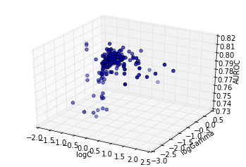
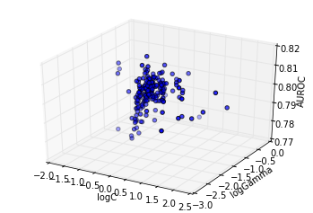
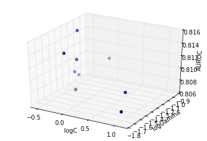

Optimization response surface
=============================

In this example we will use Optunity to optimize hyperparameters for a
support vector machine classifier (SVC) in scikit-learn. We will
construct a simple toy data set to illustrate that the response surface
can be highly irregular for even simple learning tasks (i.e., the
response surface is non-smooth, non-convex and has many local minima).

.. code:: python

    import optunity
    import optunity.metrics
    
    # comment this line if you are running the notebook
    import sklearn.svm
    import numpy as np
    import math
    import pandas
    
    %matplotlib inline
    from matplotlib import pylab as plt
    from mpl_toolkits.mplot3d import Axes3D
Create the data set: we use the MNIST data set and will build models to
distinguish digits 8 and 9.

.. code:: python

    npos = 200
    nneg = 200
    
    delta = 2 * math.pi / npos
    radius = 2
    circle = np.array(([(radius * math.sin(i * delta), 
                         radius * math.cos(i * delta)) 
                        for i in range(npos)]))
    
    neg = np.random.randn(nneg, 2)
    pos = np.random.randn(npos, 2) + circle
    
    data = np.vstack((neg, pos))
    labels = np.array([False] * nneg + [True] * npos)
Lets have a look at our 2D data set.

.. code:: python

    plt.plot(neg[:,0], neg[:,1], 'ro')
    plt.plot(pos[:,0], pos[:,1], 'bo')

.. parsed-literal::

    [<matplotlib.lines.Line2D at 0x7fefe2161b90>]

.. image:: local-optima_files/output_6_1.png

First, lets see the performance of an SVC with default hyperparameters.

Tune SVC with RBF kernel 
-------------------------

In order to use Optunity to optimize hyperparameters, we start by
defining the objective function. We will use 5-fold cross-validated area
under the ROC curve. We will regenerate folds for every iteration, which
helps to minimize systematic bias originating from the fold
partitioning.

We start by defining the objective function ``svm_rbf_tuned_auroc()``,
which accepts :math:`C` and :math:`\gamma` as arguments.

.. code:: python

    @optunity.cross_validated(x=data, y=labels, num_folds=5, regenerate_folds=True)
    def svm_rbf_tuned_auroc(x_train, y_train, x_test, y_test, logC, logGamma):
        model = sklearn.svm.SVC(C=10 ** logC, gamma=10 ** logGamma).fit(x_train, y_train)
        decision_values = model.decision_function(x_test)
        auc = optunity.metrics.roc_auc(y_test, decision_values)
        return auc
Now we can use Optunity to find the hyperparameters that maximize AUROC.

.. code:: python

    optimal_rbf_pars, info, _ = optunity.maximize(svm_rbf_tuned_auroc, num_evals=300, logC=[-2, 2], logGamma=[-5, 0])
    # when running this outside of IPython we can parallelize via optunity.pmap
    # optimal_rbf_pars, _, _ = optunity.maximize(svm_rbf_tuned_auroc, 150, C=[0, 10], gamma=[0, 0.1], pmap=optunity.pmap)
    
    print("Optimal parameters: " + str(optimal_rbf_pars))
    print("AUROC of tuned SVM with RBF kernel: %1.3f" % info.optimum)

.. parsed-literal::

    Optimal parameters: {'logGamma': -1.1793256704935242, 'logC': -0.46768229166666586}
    AUROC of tuned SVM with RBF kernel: 0.815

We can turn the call log into a pandas dataframe to efficiently inspect
the solver trace.

.. code:: python

    df = optunity.call_log2dataframe(info.call_log)
The past function evaluations indicate that the response surface is
filled with local minima, caused by finite sample effects. To see this,
we can make surface plots.

.. code:: python

    cutoff = 0.5
    fig = plt.figure()
    ax = fig.add_subplot(111, projection='3d')
    ax.scatter(xs=df[df.value > cutoff]['logC'], 
               ys=df[df.value > cutoff]['logGamma'], 
               zs=df[df.value > cutoff]['value'])
    ax.set_xlabel('logC')
    ax.set_ylabel('logGamma')
    ax.set_zlabel('AUROC')

.. parsed-literal::

    <matplotlib.text.Text at 0x7fefde77ab90>

.. image:: local-optima_files/output_16_1.png

The above plot shows the particles converge directly towards the
optimum. At this granularity, the response surface appears smooth.

However, a more detailed analysis reveals this is not the case, as shown
subsequently: - showing the sub trace with score up to 90% of the
optimum - showing the sub trace with score up to 95% of the optimum -
showing the sub trace with score up to 99% of the optimum

.. code:: python

    cutoff = 0.9 * info.optimum
    fig = plt.figure()
    ax = fig.add_subplot(111, projection='3d')
    ax.scatter(xs=df[df.value > cutoff]['logC'], 
               ys=df[df.value > cutoff]['logGamma'], 
               zs=df[df.value > cutoff]['value'])
    ax.set_xlabel('logC')
    ax.set_ylabel('logGamma')
    ax.set_zlabel('AUROC')

.. parsed-literal::

    <matplotlib.text.Text at 0x7fefde686210>

.. code:: python

    cutoff = 0.95 * info.optimum
    fig = plt.figure()
    ax = fig.add_subplot(111, projection='3d')
    ax.scatter(xs=df[df.value > cutoff]['logC'], 
               ys=df[df.value > cutoff]['logGamma'], 
               zs=df[df.value > cutoff]['value'])
    ax.set_xlabel('logC')
    ax.set_ylabel('logGamma')
    ax.set_zlabel('AUROC')

.. parsed-literal::

    <matplotlib.text.Text at 0x7fefde5cd5d0>

.. code:: python

    cutoff = 0.99 * info.optimum
    fig = plt.figure()
    ax = fig.add_subplot(111, projection='3d')
    ax.scatter(xs=df[df.value > cutoff]['logC'], 
               ys=df[df.value > cutoff]['logGamma'], 
               zs=df[df.value > cutoff]['value'])
    ax.set_xlabel('logC')
    ax.set_ylabel('logGamma')
    ax.set_zlabel('AUROC')

.. parsed-literal::

    <matplotlib.text.Text at 0x7fefde505dd0>

