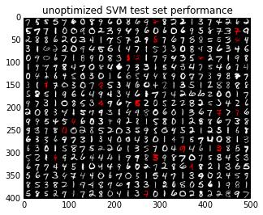

OpenCV: optical character recognition
=====================================

We will use OpenCV (http://www.opencv.org/) for optical character
recognition (OCR) using support vector machine (SVM) classifiers. This
example is based on OpenCV's digit tutorial (available in
``OPENCV_ROOT/samples/python2/digits.py``).

We start with the necessary imports.

.. code:: python

    import cv2
    import numpy as np
    import optunity
    import optunity.metrics
    
    # comment the line below when running the notebook yourself
    %matplotlib inline 
    import matplotlib.pyplot as plt
    
    # finally, we import some convenience functions to avoid bloating this tutorial
    # these are available in the `OPTUNITY/notebooks` folder
    import opencv_utility_functions as util
Load the data, which is available in the ``OPTUNITY/notebooks``
directory. This data file is a direct copy from OpenCV's example.

.. code:: python

    digits, labels = util.load_digits("opencv-digits.png")

.. parsed-literal::

    loading "opencv-digits.png" ...

We preprocess the data and make a train/test split.

.. code:: python

    rand = np.random.RandomState(100)
    shuffle = rand.permutation(len(digits))
    digits, labels = digits[shuffle], labels[shuffle]
    
    digits2 = map(util.deskew, digits)
    samples = util.preprocess_hog(digits2)
    
    train_n = int(0.9*len(samples))
    
    digits_train, digits_test = np.split(digits2, [train_n])
    samples_train, samples_test = np.split(samples, [train_n])
    labels_train, labels_test = np.split(labels, [train_n])
    
    test_set_img = util.mosaic(25, digits[train_n:])
    plt.title('Test set digits')
    plt.imshow(test_set_img, cmap='binary_r')

.. parsed-literal::

    <matplotlib.image.AxesImage at 0x7fd3ee2e4990>

.. image:: opencv-ocr_files/output_7_1.png

Now, it's time to construct classifiers. We will use a SVM classifier
with an RBF kernel, i.e.
:math:`\kappa(\mathbf{u},\mathbf{v}) = \exp(-\gamma\|\mathbf{u}-\mathbf{v}\|^2)`.
Such an SVM has two hyperparameters that must be optimized, namely the
misclassification penalty :math:`C` and kernel parameter :math:`\gamma`.

We start with an SVM with default parameters, which in this case means:
:math:`C=1` and :math:`\gamma=0.5`.

.. code:: python

    model_default = util.SVM()
    model_default.train(samples_train, labels_train)
    vis_default, err_default = util.evaluate_model(model_default, digits_test, samples_test, labels_test)
    plt.title('unoptimized SVM test set performance')
    plt.imshow(vis_default)

.. parsed-literal::

    error: 4.20 %
    confusion matrix:
    [[50  0  0  0  0  0  0  0  0  0]
     [ 0 45  0  0  1  0  0  0  0  0]
     [ 0  0 43  1  0  0  0  0  3  1]
     [ 0  0  0 48  0  1  0  1  0  0]
     [ 0  0  0  0 52  0  2  0  1  1]
     [ 0  0  0  0  0 49  0  0  0  0]
     [ 0  0  0  0  0  0 48  0  0  0]
     [ 0  0  1  3  0  0  0 54  0  0]
     [ 0  1  0  0  0  2  0  0 50  0]
     [ 1  0  0  0  0  0  0  1  0 40]]
    

.. parsed-literal::

    <matplotlib.image.AxesImage at 0x7fd3ee288ad0>

Next, we will construct a model with optimized hyperparameters. First we
need to build Optunity's objective function. We will use 5-fold
cross-validated error rate as loss function, which we will minimize.

.. code:: python

    @optunity.cross_validated(x=samples_train, y=labels_train, num_folds=5)
    def svm_error_rate(x_train, y_train, x_test, y_test, C, gamma):
        model = util.SVM(C=C, gamma=gamma)
        model.train(x_train, y_train)
        resp = model.predict(x_test)
        error_rate = (y_test != resp).mean()
        return error_rate
We will use Optunity's default solver to optimize the error rate given
:math:`0 < C < 5` and :math:`0 < \gamma < 10` and up to 50 function
evaluations. This may take a while.

.. code:: python

    optimal_parameters, details, _ = optunity.minimize(svm_error_rate, num_evals=50,
                                                       C=[0, 5], gamma=[0, 10])
    # the above line can be parallelized by adding `pmap=optunity.pmap`
    # however this is incompatible with IPython
    
    print("Optimal parameters: C=%1.3f, gamma=%1.3f" % (optimal_parameters['C'], optimal_parameters['gamma']))
    print("Cross-validated error rate: %1.3f" % details.optimum)

.. parsed-literal::

    Optimal parameters: C=1.798, gamma=6.072
    Cross-validated error rate: 0.025

Finally, we train a model with the optimized parameters and determine
its test set performance.

.. code:: python

    model_opt = util.SVM(**optimal_parameters)
    model_opt.train(samples_train, labels_train)
    vis_opt, err_opt = util.evaluate_model(model_opt, digits_test, samples_test, labels_test)
    plt.title('optimized SVM test set performance')
    plt.imshow(vis_opt)

.. parsed-literal::

    error: 2.80 %
    confusion matrix:
    [[50  0  0  0  0  0  0  0  0  0]
     [ 0 45  0  0  1  0  0  0  0  0]
     [ 0  0 44  1  0  0  0  1  1  1]
     [ 0  0  0 49  0  0  0  1  0  0]
     [ 0  0  1  0 53  0  2  0  0  0]
     [ 0  0  0  0  0 49  0  0  0  0]
     [ 0  0  0  0  0  0 48  0  0  0]
     [ 0  0  2  0  0  0  0 56  0  0]
     [ 0  1  0  0  0  1  0  0 51  0]
     [ 0  0  0  0  0  0  0  1  0 41]]
    

.. parsed-literal::

    <matplotlib.image.AxesImage at 0x7fd3ee4da050>

.. image:: opencv-ocr_files/output_16_2.png

.. code:: python

    print("Reduction in error rate by optimizing hyperparameters: %1.1f%%" % (100.0 - 100.0 * err_opt / err_default))

.. parsed-literal::

    Reduction in error rate by optimizing hyperparameters: 33.3%

