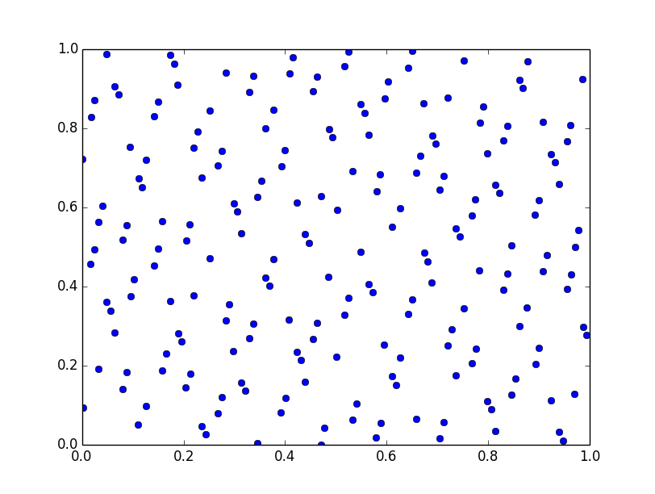
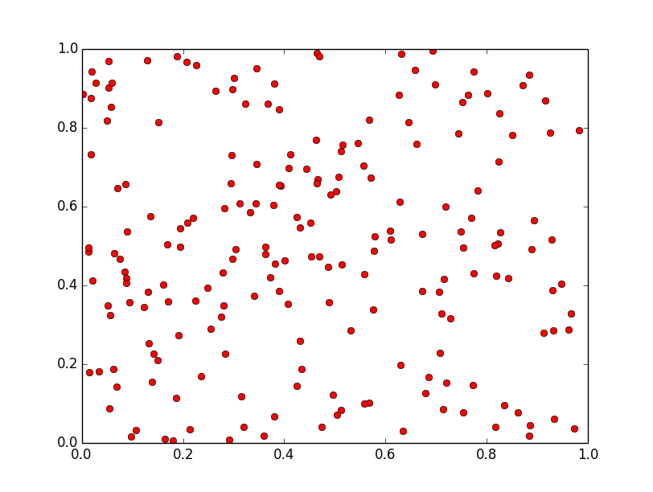

Sobol sequences
===============

.. include:: /global.rst

A Sobol sequence is a low discrepancy quasi-random sequence. Sobol sequences were designed to cover the unit 
hypercube with lower discrepancy than completely random sampling (e.g. |randomsearch|). Optunity supports Sobol
sequences in up to 40 dimensions (e.g. 40 hyperparameters). 

The figures below show the differences between a Sobol sequence and sampling uniformly at random.
These figures can be recreated using the code in `bin/examples/python/sobol_vs_random.py`.

    200 points sampled in 2D with a Sobol sequence.

    200 points sampled in 2D uniformly at random.

The mathematical details on Sobol sequences are available in the following papers: [SOBOL]_, [SOBOL2]_, [ANTONOV]_, [BRATLEY]_, [FOX]_.

.. [SOBOL] Ilya Sobol, USSR Computational Mathematics and Mathematical Physics, Volume 16, pages 236-242, 1977.

.. [SOBOL2] Ilya Sobol, Levitan, The Production of Points Uniformly Distributed in a Multidimensional Cube (in Russian), Preprint IPM Akad. Nauk SSSR, Number 40, Moscow 1976.

.. [ANTONOV] Antonov, Saleev, USSR Computational Mathematics and Mathematical Physics, Volume 19, 1980, pages 252 - 256.

.. [BRATLEY] Paul Bratley, Bennett Fox, Algorithm 659: Implementing Sobol's Quasirandom Sequence Generator, ACM Transactions on Mathematical Software, Volume 14, Number 1, pages 88-100, 1988.

.. [FOX] Bennett Fox, Algorithm 647: Implementation and Relative Efficiency of Quasirandom Sequence Generators, ACM Transactions on Mathematical Software, Volume 12, Number 4, pages 362-376, 1986.

